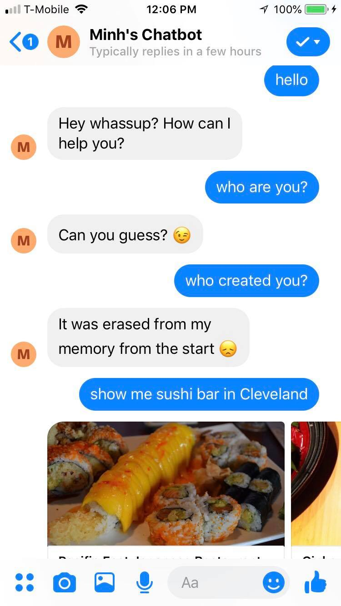
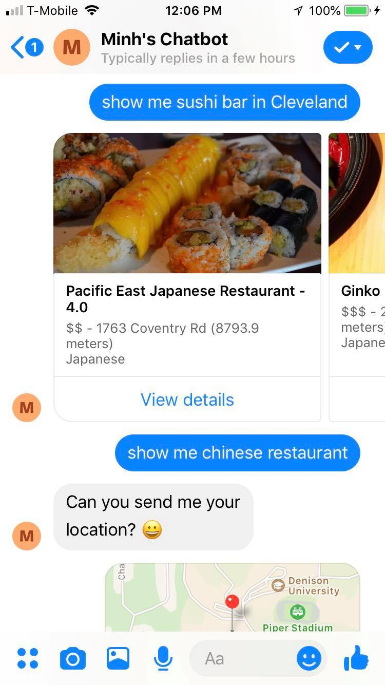
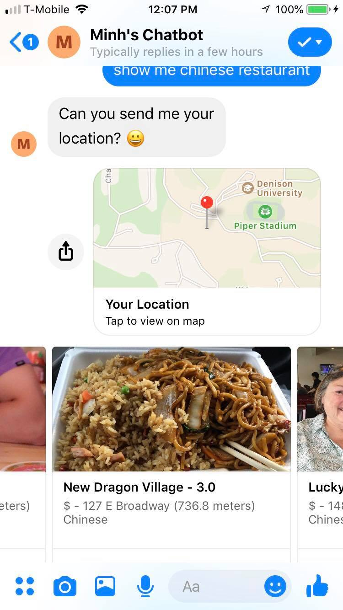

Facebook Restaurant Bot
======

This is a Facebook Messenger Bot that supports Natural Language Processing and features such as: search restaurants based on location and food preferences. It can provide customized greetings and entertaining responses, etc.


**Table of Contents**


- [Features](#features)
- [Usage](#usage)
  - [Dependencies, Database and API keys](#dependencies-database-and-api-keys)
  - [Natural Language Processing](#natural-language-processing)
  - [Custom features](#custom-features)
    - [1. Chit-chat](#1-chit-chat)
    - [2. Restaurant Search](#2-businessrestaurant-search)


#### Features:
- Understanding commands with Natural Language Processing and contextual follow-up
- Restaurant Search
- Conversational chit-chat


## Usage

#### Dependencies, Database and API keys

In order to build your own bot with all features of Optimist Prime, you'll need a few set-ups:

0. Install dependencies: `pip install -r requirements.txt` (preferably getting into your virtual environment `virtualenv`/`venv` - read all about `pip` and `venv` [here](https://packaging.python.org/installing/))
1. [Create a Facebook Page](https://www.facebook.com/pages/create/): A bare-bone Page to "assign" the Bot to will do. The Bot will actually be this page, i.e. you'll be "talking" to the page
2. [Create a Facebook App](https://developers.facebook.com/docs/apps/register), get its Page Access Token (details at Facebook's [Quick Start](https://developers.facebook.com/docs/messenger-platform/quickstart/))


To run locally, as simple as:
```bash
python facebookbot.py 3000
```

Now that you've got the bot running, you'll need to set up a webhook for Facebook to send messages the bot receives to. This could be done with `ngrok`, which will set up a secure tunnel to your localhost server:
```bash
./ngrok http 3000
```


Get the `https` URL (Facebook requires `https` secured webhooks) and subscribe your Facebook App to this webhook. The verification token is your own token.


## Natural Language Processing

The Bot receives commands from users and understands commands in natural language. This is done by using the `pattern` NLP [library](http://www.clips.ua.ac.be/pages/pattern-en), which allows the bot to deconstruct the user's text input and recognize parts of speech. 

The command system allows users to use the following features, all of which are under the `Utils` folder.

## Custom features
### 1. Chit-chat


### 2. Business/Restaurant Search



Example commands for nearby restaurants:
```
		irish bar near by.
		find chinese restaurants.
		find me a good coffee shop around here.
		show me Chinese food close by.
		find mexican restaurants near here.
		I want to have vietnamese food tonight.
		is there a korean bbq nearby?
		what are some cambodian grill close by?
		find an ethiopian restaurant.
		I want mediterranean food.
		find a Target.
		find me a KFC around.
		I'd like to eat at McDonalds.
		find me some fast food places in ohio city.
		find me a brewery near downtown san francisco.
```

After receiving the command, it would ask for your location. You then need to send your **exact GPS location** (with Facebook Messenger on mobile devices). 



Restaurant__Bot leverage Yelp's API. Included in the code is both the APIv2 (stable) and APIv3 (developer preview). Both require you to acquire their API key.

[Get API key for v2](https://www.yelp.com/developers/manage_api_keys)

[Get API key for v3](https://www.yelp.com/developers/v3/preview)

```python
from Utils.Yelp import yelp_search_v3 as yelp_search
```

## License 
* MIT License

## Version 
* Version 1.0
